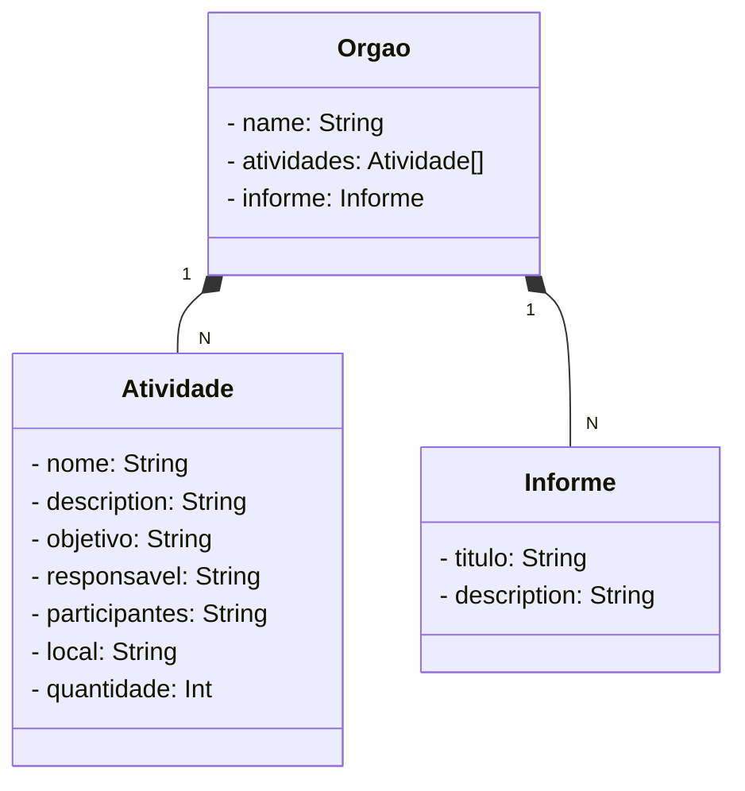

# projeto-final-java-santander-2023
Java RESTful API desenvolvido como projeto final do Santander Java BootCamp 2023.

## Diagrama de classes

```mermaid
classDiagram
  class Orgao {
    - name: String
    - atividades: Atividade[]
    - informe: Informe
  }
  class Atividade {
    - nome: String
    - description: String
    - objetivo: String
    - responsavel: String
    - participantes: String
    - local: String
    - quantidade: Int
  }
  class Informe {
    - titulo: String
    - description: String
  }

  Orgao "1" *-- "N" Atividade
  Orgao "1" *-- "N" Informe
```
